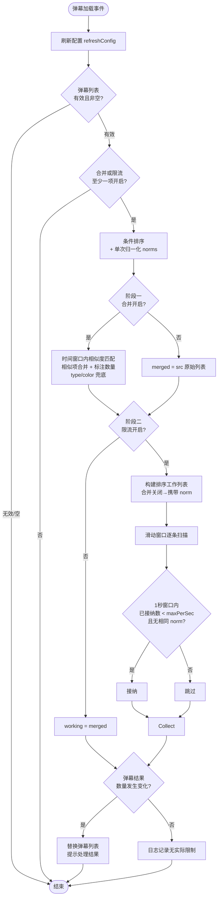

# 弹幕限制器

- **ID**: `heylyx841.danmaku_limiter`
- **作者**: Heylyx841
- **版本**: 1.1.1
- **最低 NipaPlay 版本**: 1.10.7

## 功能介绍

本插件监听 `danmakuLoaded` 事件，在弹幕正式渲染前进行高效拦截与实时优化：

- **密度限制**（独立开关，默认开启）：采用滑动窗口算法，精确控制每秒弹幕密度（默认 5 条/秒），消除硬分桶的秒边界效应；超限时保留窗口内最早到达的弹幕，防止满屏弹幕遮挡画面。关闭后不执行限流和去重。
- **模糊去重**：对1秒滑动窗口内的弹幕进行内容归一化处理（忽略大小写、特殊符号、重复冗余字符），优先保留独特内容。
- **相似合并**（独立开关）：在时间窗口内模糊匹配相似弹幕，合并为单条并标注合并数，替代原生合并渲染。
- **小字兼容**：部分设备无法显示 Unicode 下标 ₍ɴ₎，开启后改用 (N) 标注合并数。
- **配置持久化**：提供设置页交互，支持独立开关及自定义每秒上限，配置自动保存且跨会话持久化。

## 核心流程

## 更新日志

### 1.1.1 更新

- **移除总开关**：插件的启用/禁用由宿主设置页统一管理，不再需要插件内部的总开关。关闭密度限制和合并弹幕即可等效关闭所有功能。
- **开关持久化改用原生 API**：移除 `_cfg` 编码 hack，改用 `settings.setSwitch()` / `settings.getSwitch()` 原生开关持久化接口，不再将开关状态编码为字符串暴露给用户编辑。
- **移除 `_cfg` 内部条目**：设置页中不再显示内部配置码文本框，减少用户误操作风险。
- **无过滤时静默处理**：未发生拦截时不再弹出 SnackBar 提示，改为 `dev.log()` 记录，避免视觉干扰；仅在实际拦截生效时弹出 SnackBar。
- **移除 `pluginOnInitialize` 中的 `refreshConfig` 调用**：因宿主初始化时序（运行时评估先于设置值加载），改为在 `danmakuLoaded` 事件中通过 `refreshConfig()` 恢复开关状态。
- **`minHostVersion` 提升至 `1.10.7`**。
- **流程图并入 README**。

### 1.1.0 更新

- **新增相似弹幕合并**：由于 NipaPlay 目前（插件开发时 NipaPlay 版本：1.10.6）的原生合并渲染在部分设备上存在显示异常，现已引入替代方案：通过此插件进行合并，并采用 ₍ɴ₎ 下标（或兼容模式下的 (N)）标注合并数量。
- **密度限制独立开关**：密度限制不再跟总开关捆绑。
- **新增小字兼容开关**：部分设备无法渲染 Unicode 下标字符 ₍ɴ₎，开启后改用 (N) 标注。
- **操作反馈更新**：拦截/合并生效时显示 SnackBar 提示；无实际过滤时提示「无实际弹幕限制」。
- **修改名称**：`弹幕数量控制器` → `弹幕限制器`。
- **`priority` 提升至 80**：确保在其他插件完成弹幕过滤后再执行限制。
- **修复开关状态重启丢失**：NipaPlay 目前仅对 `textSetting` 条目预加载持久化值，开关条目的值不在预加载范围，导致 App 重启后开关回滚为默认值。现通过 `_cfg` 配置码条目将所有开关状态编码持久化，暂时解决此问题。
- **修复合并弹幕字段缺失**：合并后的弹幕项对 `type` 和 `color` 字段增加了兜底默认值（`scroll` / `rgb(255,255,255)`），防止传入的数据缺少这些字段时引发渲染异常。
- **配置即时生效**：每次 `danmakuLoaded` 事件触发时先调用 `refreshConfig()`，确保用户在设置页的修改在下一次弹幕加载时立即生效。

### 1.0.4 更新

- **规范兼容**：升级 `pluginManifest`，适配 NipaPlay JS 插件新规范。
- **版本对齐**：最低宿主版本提升至 `1.10.6`，插件版本更新至 `1.0.4`。
- **优先级声明**：新增 `priority: 50`。

### 1.0.3 更新

- **ID 规范化**：迁移至唯一标识符 `heylyx841.danmaku_limiter`，符合插件市场规范。
- **高性能桶排序**：采用 JavaScript 稀疏数组替代对象哈希映射处理时间分桶，提升大规模弹幕处理性能。
- **低能耗 IPC 通信**：优化了与 Flutter 的桥接通信逻辑。仅在弹幕实际触发过滤、总数发生变化时才调用 `danmaku.replace`，若弹幕未超标则零开销跳过，降低 CPU 占用。