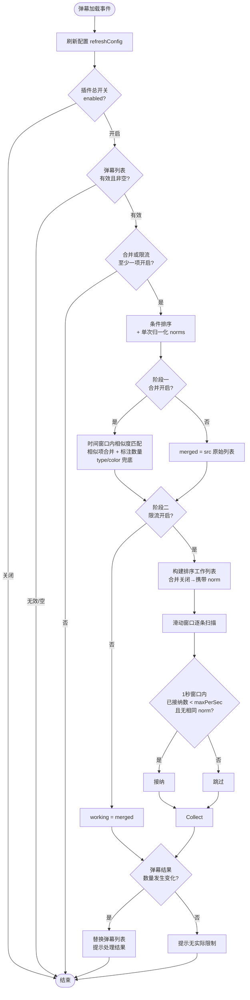

# 弹幕限制器核心 flowchart

```mermaid
flowchart TD
    Start([弹幕加载事件]) --> Refresh[刷新配置 refreshConfig]
    Refresh --> Check1{插件总开关<br/>enabled?}
    Check1 -->|关闭| End1([结束])
    Check1 -->|开启| Check2{弹幕列表<br/>有效且非空?}
    Check2 -->|无效/空| End1
    Check2 -->|有效| Check3{合并或限流<br/>至少一项开启?}
    Check3 -->|否| End1
    Check3 -->|是| Prep[条件排序<br/>+ 单次归一化 norms]

    Prep --> Phase1{阶段一<br/>合并开启?}
    Phase1 -->|是| Merge[时间窗口内相似度匹配<br/>相似项合并 + 标注数量<br/>type/color 兜底]
    Phase1 -->|否| SkipMerge[merged = src 原始列表]
    Merge --> Phase2
    SkipMerge --> Phase2

    Phase2{阶段二<br/>限流开启?}
    Phase2 -->|否| Output[working = merged]
    Phase2 -->|是| BuildWorkList[构建排序工作列表<br/>合并关闭→携带 norm]

    BuildWorkList --> SlideWindow[滑动窗口逐条扫描]
    SlideWindow --> UnderLimit{1秒窗口内<br/>已接纳数 < maxPerSec<br/>且无相同 norm?}
    UnderLimit -->|是| Accept[接纳]
    UnderLimit -->|否| Skip[跳过]

    Accept --> Collect
    Skip --> Collect
    Output --> ChangedCheck
    Collect --> ChangedCheck

    ChangedCheck{弹幕结果<br/>数量发生变化?}
    ChangedCheck -->|是| Replace[替换弹幕列表<br/>提示处理结果]
    ChangedCheck -->|否| NoChange[提示无实际限制]
    Replace --> End1
    NoChange --> End1
```